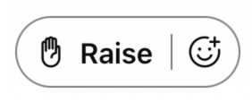

# Lab 4: Agent administration: Part 1

In this lab, you will learn how to create skill definitions, skill profiles and multimedia profiles.

### Customer contact inquiries should be routed based on agents’ appropriate expertise.

Contact Center > User Management > Skill Management > Create a skill

* Skill Name: Investment\_Lvl
  + Description: Proficiency of support knowledge for investment customers
  + Skill Type: Proficiency
  + Service Level Threshold: 120
* Skill Name: Financial Service
  + Description: Agents approved to support Financial Services
  + Skill Type: Boolean
  + Service Level Threshold: 120
* Skill Name: Insurance Management *Hint: Duplicate the previous skill*
  + Description: Agents approved to support Insurance Management
  + Skill Type: Boolean
  + Service Level Threshold: 120

### Each agent has different skills and should have the appropriate skills assigned to them.

Contact Center > User Management > Skill Profiles

Hint: Use the copy icon and edit as needed.

|  |  |  |  |
| --- | --- | --- | --- |
| Skill Profile Name | Financial Service | Insurance Management | InvestmentLvl |
| Eric\_SP | TRUE | TRUE | 9 |
| Kellie\_SP | TRUE | TRUE | 9 |
| Rebekah\_SP | TRUE | FALSE | 8 |
| Ricardo\_SP | FALSE | TRUE | 4 |
| Stefan\_SP | FALSE | TRUE | 3 |
| Taylor\_SP | FALSE | TRUE | 1 |

### Agents should handle only one chat at a time to ensure prompt responses.

Contact Center > Desktop Experience > Multimedia Profiles

* Name: Voice\_Chat\_MPP
* Description: Exclusive: Voice and Chat
* Automatically Pushed Contacts: Exclusive
* Voice and Chat only selected

| Help articles | | |
| --- | --- | --- |
| [Manage skill profiles](https://help.webex.com/en-us/article/arzaac/Manage-skill-profile-in-Webex-Contact-Center) | [Manage skill definitions](https://help.webex.com/en-us/article/6rzxls/Manage-skill-definitions-in-Webex-Contact-Center) | [Manage multimedia profiles](https://help.webex.com/en-us/article/nje7dhdb/Manage-multimedia-profiles) |

STOP: End of Lab 4

Raise your hand and leave it raised in the Webex Meeting. Wait for further instruction.  

