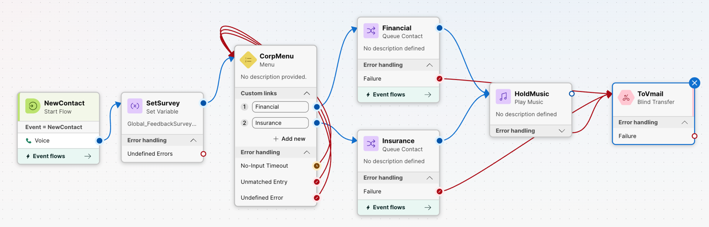
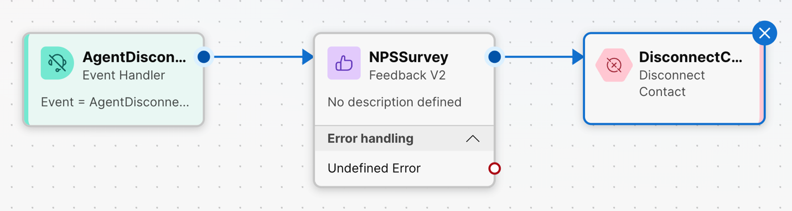
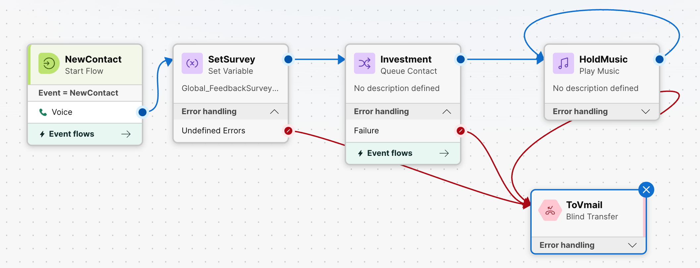
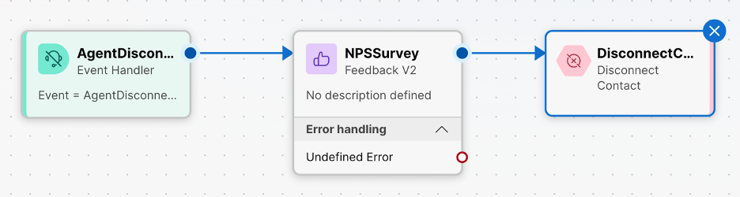
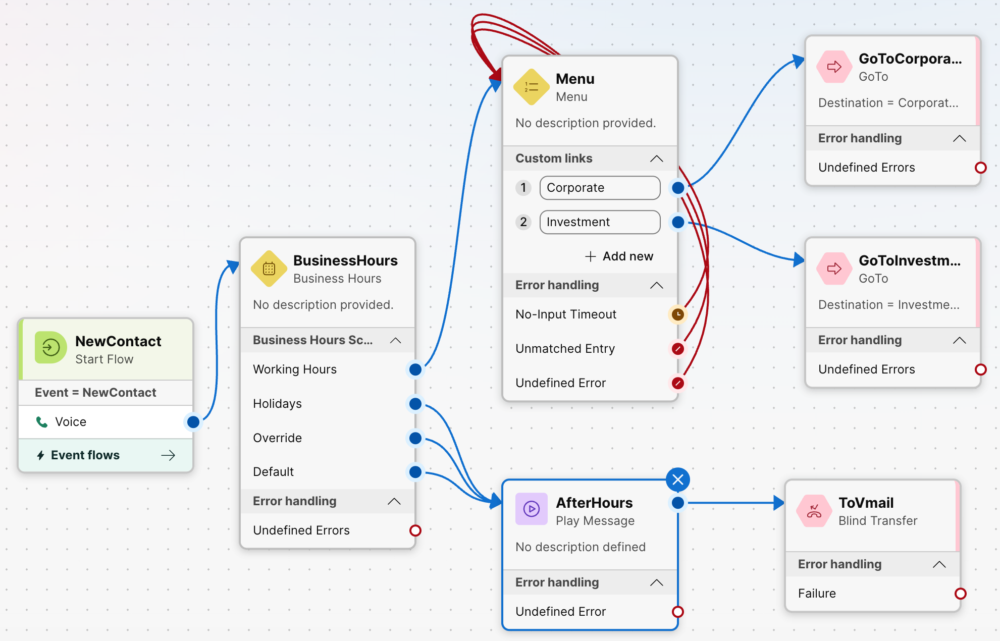

# Lab 9: Voice queue flows

In this lab, you will learn how to create flows for voice queues.

### Create a flow for calls to the Corporate banking departments of Yellow Brick Bank.

Contact Center > Customer Experience > Flows > Manage flows > Create flows

Flow Designer will open in new browser tab

* Start from scratch
* Flow name: CorporateFlow
  + Global Flow Properties – *Found on right side of the Flow Designer canvas*
    - Predefined Variables: Global Variables
      * Add Global Variables: Global\_FeedbackSurveyOptin

### 1.1 Add the following blocks to the Main Flow canvas. Do NOT connect the blocks until instructed.

**Activity: Menu**

* Activity Label: CorpMenu
* Prompt: Enable text-to-speech
  + Connector: Cisco Cloud Text-to-Speech
  + Add Text-to-Speech Message
    - Text: Press one for Financial Services Banking and two for Insurance Management
  + Make prompt interruptible: Enable
  + Be sure to delete the select audio file field that was added by default
* Custom Menu Links
  + Digit Number 1 = Financial
  + Digit Number 2 = Insurance

**Activity: Queue Contact**

* Activity Label: Financial
* Contact Handling > Queue: Corporate Q
* Skill Requirements: Financial Service is true
* Skill Relaxation: Enable
  + Skill Relaxation Step 1: Delete skill requirement

**Activity: Queue Contact**

* Activity Label: Insurance
* Contact Handling > Queue: Corporate Q
* Skill Requirements: Insurance Management is true
* Skill Relaxation: Enable
  + Skill Relaxation Step 1: Delete skill requirement

**Activity: Play Music**

* Activity Label: HoldMusic
* Music file: defaultmusic\_on\_hold\_cisco\_opus\_no\_1.wav

**Activity: Blind Transfer**

* Activity Label: ToVmail
* Specific dial number: 5000

**Activity: Set Variable**

* Activity Label: SetSurvey
* Variable: Global\_FeedbackSurveyOptin
  + Variable value – Set value: True

### 1.2 Link the Activities together

* NewContact Activity
  + Output –> SetSurvey
* SetSurvey Activity
  + Output -> CorpMenu
  + Undefined Error -> ToVmail
* CorpMenu Activity
  + Custom Link 1 –> Financial
  + Custom Link 2 –> Insurance
  + All Error Handling –> CorpMenu (loop to start of menu)
* Financial Activity
  + Output -> HoldMusic
  + Failure -> ToVmail
* Insurance Activity
  + Output -> HoldMusic
  + Failure -> ToVmail
* HoldMusic Activity
  + Output -> HoldMusic (loop to start of HoldMusic)
  + Undefined Error -> ToVmail

Tip: Use the Auto Arrange icon at the bottom of the canvas to clean up your activities and connectors

### 1.3 Add the following blocks to the Event Flows canvas. Do NOT connect the blocks until instructed.

**Activity: Feedback V2**

* Activity Label: NPSSurvey
  + Survey method – Voice Based
    - Customer NPS

**Activity: Disconnect Contact**

### 1.4 Link the Activities together

* Agent Disconnected Activity
  + Output –> NPSSurvey
* NPS Survey Activity
  + Output -> DisconnectContact

### 1.5 Validate and Publish

### Repeat for the Investment Flow.

Contact Center > Customer Experience > Flows > Manage flows

Create a copy of the corporate flow. Turn on edit function at top of Flow Designer page once the copied flow is opened.

Flow name: InvestmentFlow (Edit at top of page using drop down arrow > Edit name)

* Remove CorpMenu activity
* Remove one queue
* Change the name of the remaining queue to Investment
  + Contact Handling > Queue: Investment Q

### 2.1 Link the Activities together

* NewContact Activity
  + Output –> SetSurvey
* SetSurvey Activity
  + Output -> Investment Activity
  + Undefined Error -> ToVmail
* Investment Activity
  + Output -> HoldMusic
  + Failure -> ToVmail
* HoldMusic Activity
  + Output -> HoldMusic (loop to start of HoldMusic)
  + Undefined Error -> ToVmail

### 2.2 Validate and Publish

### 3. Callers should hear a menu to select the appropriate options for their needs. Create a principal menu flow.

Contact Center > Customer Experience > Flows > Manage flows > Create flows

Flow Designer will open in new browser tab

* Start from scratch
* Flow name: PrincipalMenu
  + Global Flow Properties – *Found on right side of the Flow Designer canvas*
    - Flow Description: Menu to Corporate and Investment Flows

### 3.1 Add the following blocks to the main flow canvas. Do NOT connect the blocks until instructed.

**Activity: Menu**

* Activity Label: Menu
* Prompt: Enable text-to-speech
  + Connector: Cisco Cloud Text-to-Speech
  + Add Text-to-Speech Message
    - Text: Welcome to Yellow Brick Bank. Press one for Corporate Banking and two for Investment Banking.
  + Make prompt interruptible: Enable
  + Be sure to delete the select audio file field that was added by default
* Custom Menu Links
  + Digit Number 1 = Corporate
  + Digit Number 2 = Investment

**Activity: GoTo**

* Activity Label: GoToCorporate
* Destination type: Flow: CorporateFlow

**Activity: GoTo**

* Activity Label: GoToInvestment
* Destination type: Flow: InvestementFlow

**Activity: Business Hours**

* Activity Label: BusinessHours
* Static business hours: YBB HQ Open hours

**Activity: Play Message**

* Activity Label: AfterHours
  + Prompt: Enable text-to-speech
  + Connector: Cisco Cloud Text-to-Speech
  + Add Text-to-Speech Message
    - Text: Our offices are closed. Please contact us Monday through Friday 8:00 am until 5:00 pm.
  + Be sure to delete the select audio file field that was added by default

**Activity: Blind Transfer**

* Activity Label: ToVmail
* Specific dial number: 5000

### 3.2 Link the Activities together

* New Contact Activity
  + Output –> Business Hours
* Business Hours Activity
  + Output Working Hours -> Menu
  + Output Holidays -> AfterHours
  + Output Override -> AfterHours
  + Output Default -> AfterHours
  + Undefined Errors -> ToVmail
* AfterHours Activity
  + Output -> ToVmail
* Menu Activity
  + Custom Link 1 -> GoToCorporate
  + Custom Link 2 -> GoToInvestement
  + All error handling -> Menu (Loops to start of Menu)

### 3.3 Validate and Publish

| Help articles | |
| --- | --- |
| [Flow Designer](https://help.webex.com/en-us/article/nhovcy4/Flow-Designer) |  |

STOP: End of Lab 9

Raise your hand and leave it raised in the Webex Meeting. Wait for further instruction  

