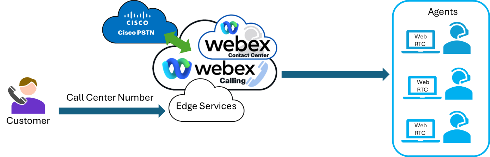
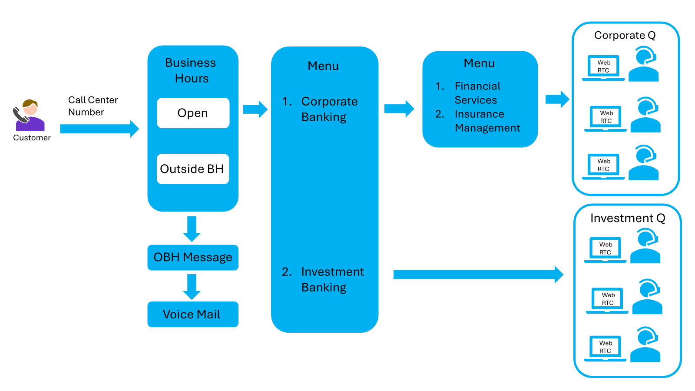

# Overview

# Customer Scenario

This scenario is the baseline configuration for the Webex Contact Center Customer Administration course. Further information for design will be provided in the lab workbook.

## Basic Customer Information

Customer Name: Yellow Brick Bank

Location: Durham, North Carolina

Business Verticals: Investment and Corporate Bank

About: Yellow Brick Bank offers Corporate and Investment Banking. Corporate Banking has 2 main products, Financial Services and Insurance Management. Investment Banking departments has experts with years of experience working in the field.

## Connectivity Requirements

Basic Connectivity Image

## Users

|  |  |  |  |
| --- | --- | --- | --- |
| Department | Agents | SUpervisors | Total |
| Corporate Banking | 3 | 1 |  |
| Investment Banking | 3 | 0 |  |
| Totals | 6 | 1 | 7 |

## Call Flows

### Additional information

* + Agents receive call on a skill basis
  + Supervisors monitor calls
  + Recording in performed

# Using this workbook

Lab URL: [admin.webex.com](http://admin.webex.com/)

Login credentials: Provided by instructor

All labs generally follow the same layout shown below

|  |
| --- |
| Numbered headings identify each lab step.  Blue italic text shows Control Hub and Contact Center navigation. |
| * Tasks to be completed |

At the end of each lab, stop and wait for further instruction. Look for the blue STOP callout and raise-hand icon.

<!-- ## Learning Objectives

This lab will give you an introduction to ...

## Disclaimer

Although the lab design and configuration examples could be used as a reference, for design related questions please contact your representative at Cisco, or a Cisco partner.

## Lab Access

From your workstation open an RDP (Remote Desktop) session to the following host named "wkst1":

- IP: 1.2.3.4
- Username: corp\demouser
- Password: C1sco12345

## Getting Started

This lab leverages Cisco dCloud ... -->
